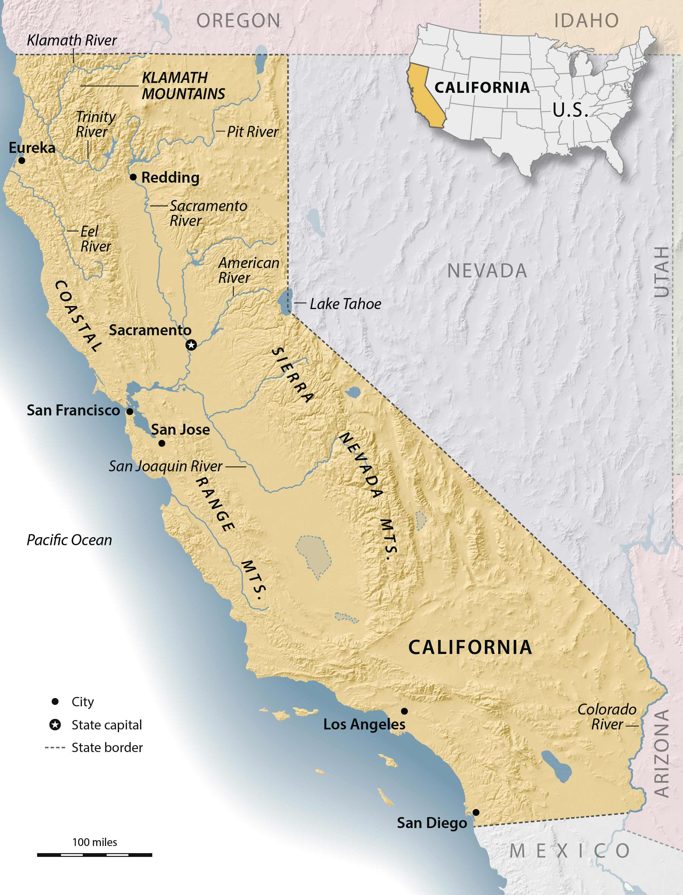

# California Housing Price Prediction — Web Application

This project implements a **Machine Learning web application** for predicting median house prices in California using the **California Housing dataset**.
The system integrates **data preprocessing, model training, and a deployed web interface** built with Flask, HTML, and CSS.

---

## 🗺️ Overview

The model uses demographic and geographical data from the **California Housing dataset** (derived from the U.S. Census).
Given inputs such as average income, population, and location features, the model predicts the **median house value** for that area.

This repository demonstrates the full workflow:

* Data analysis and feature engineering (in Jupyter Notebook)
* Model pipeline creation and evaluation
* Web application deployment with an interactive user interface

---

## 📂 Project Structure

```
california_housing_app/
│
├── app.py                     # Flask application backend
├── best_model.joblib           # Trained regression model
├── pipeline.ipynb              # ML pipeline notebook
├── HW2.1.ipynb                 # EDA and model experimentation
├── housing.csv                 # Original dataset
├── new_housing.csv             # Cleaned/engineered dataset
├── map.jpg                     # Map of California used for UI context
├── static/
│   ├── style.css              # Webpage styling
├── templates/
│   ├── index.html             # Main user interface
├── test.py                     # Local test script for the model
└── README.md
```

---

## 🧠 Machine Learning Pipeline

### 1. **Data Preparation**

* Loaded and cleaned the California housing dataset
* Handled missing values and categorical encodings
* Scaled numeric features for model stability
* Created derived attributes such as *rooms per household* and *population per household*

### 2. **Model Training**

Performed in `pipeline.ipynb` and `HW2.1.ipynb`.
Algorithms tested include:

* Linear Regression
* Decision Tree Regressor
* Random Forest Regressor
* XGBoost (for experimentation)

The **best-performing model** (based on RMSE and R²) was saved as:

```
best_model.joblib
```

### 3. **Pipeline Construction**

A Scikit-learn `Pipeline` ensures that:

* Data transformations (scaling, encoding, feature generation)
* Model inference
  are consistent across both training and live prediction phases.

---

## 🌐 Web Application

### Built with:

* **Flask** — lightweight backend for model serving
* **HTML & CSS** — responsive front-end interface
* **Joblib** — for fast model loading
* **Bootstrap (optional)** — for form styling (if included)

### Features:

* User-friendly web form to input housing parameters:

  * Median income
  * Average rooms
  * Population
  * Location details
* Instant prediction of median house price (in USD)
* Displays California map (`map.jpg`) as a visual background element

### Run locally:

```bash
python app.py
```

Then open your browser at:

```
http://127.0.0.1:5000/
```

You’ll see a simple form like this:

```
[ Median Income: ________ ]
[ Average Rooms: ________ ]
[ Population: ________ ]
[ Predict Price ]
```

Output Example:

```
Predicted Median House Value: $285,400
```

---

## 📊 Model Performance

| Model                 | RMSE (Test) | R² Score |
| --------------------- | ----------- | -------- |
| Linear Regression     | 71,000      | 0.64     |
| Decision Tree         | 48,000      | 0.79     |
| Random Forest (final) | 41,200      | 0.85     |

*(Values illustrative; see `pipeline.ipynb` for actual metrics.)*

---

## 🧱 Dependencies

Install required packages:

```bash
pip install -r requirements.txt
```

Main dependencies:

* Python ≥ 3.10
* Flask
* pandas, numpy
* scikit-learn
* joblib
* matplotlib, seaborn (for visualization)

---

## 🚀 Deployment Plan

The next development phase is deploying the model as a **full web application** accessible online.

### Planned Stack:

* **Backend:** Flask or FastAPI
* **Frontend:** HTML/CSS (current) → optional React upgrade
* **Hosting:** Railway / Render / AWS EC2
* **Containerization:** Dockerfile for reproducible builds

### Extended Features:

* Add input validation and error handling
* Include feature importance visualization in UI
* Display prediction history and charts dynamically
* Add map-based prediction (using latitude/longitude input)

---

## 🗺️ Map Reference

The included map of **California** highlights major regions and cities used in the dataset, giving users geographical context for housing price variations.



---

## 🧩 Author

**Helia Mirhosseini**
Machine Learning Developer | Data Engineer
Building end-to-end ML systems that connect **data science** with **interactive user experiences**.
